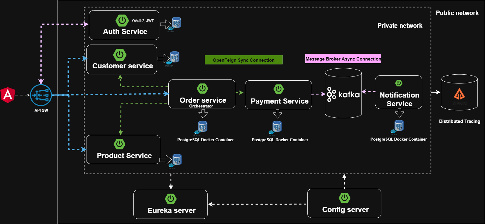
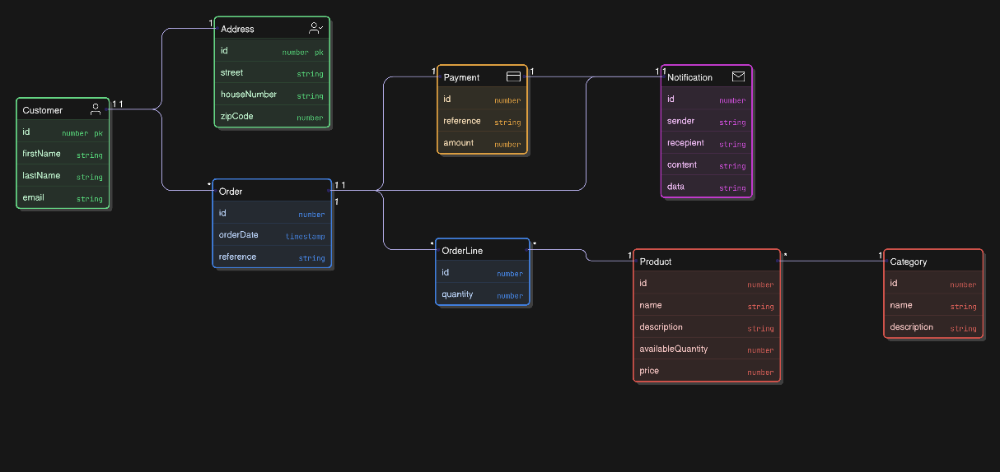

# 🛒 E-Commerce Microservice Application  

Welcome to the **E-Commerce Microservice Application**!  
This project showcases a modern **microservice-based architecture** using **Spring Boot**, **gRPC**, **GraphQL**, and other cutting-edge technologies to build a scalable, secure, and efficient e-commerce platform.  

  
  

---

## 📑 Table of Contents  
- [Introduction](#introduction)  
- [Technologies Used](#technologies-used)  
- [Architecture](#architecture)  
- [Key Features](#key-features)  
- [Services](#services)  
- [Data Model](#data-model)  

---

## 🚀 Introduction  

This **e-commerce application** is built on a **microservice architecture** that implements:  

- **Gateway with GraphQL support** for a unified API layer.  
- **Authentication Service with JWT** (access & refresh tokens) for secure access.  
- **gRPC for inter-service synchronous communication** (fast & type-safe).  
- **Kafka for asynchronous event streaming** to decouple services.  
- **MailDev integration** to test email notifications easily.  
- **Centralized Config & Service Discovery** to manage multiple services effortlessly.  

The result is a **secure**, **scalable**, and **developer-friendly** platform.  

---

## 🛠️ Technologies Used  

- **Spring Boot** – Framework for building microservices.  
- **GraphQL (via API Gateway)** – Unified data query layer for client applications.  
- **JWT (Access & Refresh Tokens)** – Secure authentication & session management.  
- **gRPC** – High-performance synchronous communication between services.  
- **Kafka** – Asynchronous messaging & event-driven architecture.  
- **MailDev** – Local email testing for notifications.  
- **PostgreSQL** – Relational database for each service (containerized with Docker).  
- **Eureka Discovery Server** – Service registry for dynamic service discovery.  
- **Config Server** – Centralized configuration for microservices.  
- **Swagger** – API documentation.  
- **Docker & Docker Compose** – Containerization & orchestration.  
- **Zipkin** – Distributed tracing.  

---

## 🏗️ Architecture  

### 🔹 Key Components  

1. **Angular Client**  
   - Consumes GraphQL APIs exposed by the API Gateway.  

2. **API Gateway (GraphQL)**  
   - Entry point for all client requests.  
   - Exposes REST + GraphQL endpoints.  
   - Routes requests to microservices over gRPC.  

3. **Auth Service**  
   - Manages user authentication & authorization.  
   - Issues **JWT access and refresh tokens**.  
   - Stores credentials securely.  

4. **Customer Service**  
   - CRUD operations for customer data.  
   - Linked with address information.  

5. **Product Service**  
   - Manages product catalog and categories.  

6. **Order Service**  
   - Handles order placement and tracking.  
   - Calls Payment Service over gRPC.  

7. **Payment Service**  
   - Manages payment transactions.  
   - Publishes events to Kafka.  

8. **Notification Service**  
   - Subscribes to Kafka topics.  
   - Sends emails via MailDev integration.  

9. **Config Server & Discovery Server**  
   - Centralized configuration management.  
   - Dynamic service discovery (Eureka).  

10. **Kafka**  
    - Asynchronous communication channel for Payment → Notification Service.  

11. **MailDev**  
    - For testing email delivery locally.  

---

### 🔹 Communication Patterns  

- **REST** – Between Client & Gateway.  
- **GraphQL** – Unified client queries at Gateway.  
- **gRPC** – High-speed synchronous communication between services.  
- **Kafka** – Event-driven asynchronous messaging.  

---

## ✨ Key Features  

- **JWT Authentication** with refresh tokens for secure, stateless sessions.  
- **GraphQL at API Gateway** for simplified API consumption.  
- **gRPC communication** between microservices for faster performance.  
- **Event-driven notification system** using Kafka.  
- **Centralized configuration & service discovery** with Config Server & Eureka.  
- **Modular database design**: each microservice has its own Postgres DB (Dockerized).  
- **Test email notifications** locally with MailDev.  

---

## 🧩 Services  

| Service               | Description                                    | Protocol | DB        |
|-----------------------|------------------------------------------------|----------|-----------|
| **Gateway**           | Entry point with GraphQL + REST support         | REST     | —         |
| **Auth Service**      | Handles JWT-based authentication                | gRPC     | PostgreSQL|
| **Customer Service**  | Manages customer data & addresses               | gRPC     | PostgreSQL|
| **Product Service**   | Manages product catalog & categories            | gRPC     | PostgreSQL|
| **Order Service**     | Manages order lifecycle & interacts with payment| gRPC     | PostgreSQL|
| **Payment Service**   | Processes payments & sends events to Kafka      | gRPC     | PostgreSQL|
| **Notification Service**| Subscribes to Kafka & sends notifications     | Async    | PostgreSQL|
| **Config Server**     | Centralized configuration management            | REST     | —         |
| **Discovery Server**  | Service registry (Eureka)                       | REST     | —         |

---

## 🗃️ Data Model  

The entity relationships across services are depicted in the **Entity-Relation Diagram** above:  

- **Customer** ↔ **Address** (1:1)  
- **Customer** ↔ **Order** (1:N)  
- **Order** ↔ **OrderLine** (1:N)  
- **OrderLine** ↔ **Product** (N:1)  
- **Product** ↔ **Category** (N:1)  
- **Order** ↔ **Payment** (1:1)  
- **Payment** ↔ **Notification** (1:N)  

Each microservice owns its respective data and database, ensuring loose coupling and high scalability.  

---

## 📬 Notifications  

- Payment confirmation and order updates trigger Kafka events.  
- Notification Service listens and sends emails to customers.  
- MailDev makes testing email delivery simple and fast.  

---
